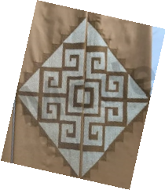
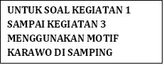
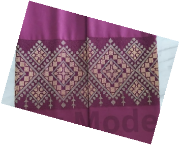

**LKPD ETNOMATEMATIKA BERBASIS DIGITAL\
TRANSFORMASI GEOMETRI DALAM SULAMAN KARAWO**

\
Identitas:

Nama Peserta Didik : \_\_\_\_\_\_\_\_\_\_\_\_\_\_\_\_\_\_\_\_\_\_\_\_\_\_

Kelas : \_\_\_\_\_\_\_\_\_\_\_\_\_\_\_\_\_\_\_\_\_\_\_\_\_\_

Tanggal : \_\_\_\_\_\_\_\_\_\_\_\_\_\_\_\_\_\_\_\_\_\_\_\_\_\_

Tujuan Pembelajaran:

1\. Memahami konsep translasi, refleksi, rotasi, dan dilatasi.

2\. Menyelesaikan masalah kontekstual berbasis sulaman karawo.

**Kegiatan 1: Translasi (Perpindahan)**

**Stimulus Soal**

**“Pola Berulang yang tanpa disadari”**

**Suatu hari, Nita membantu ibunya yang sedang menyulam kain karawo. Ia memperhatikan bahwa ibunya tidak menggambar ulang setiap motif bunga, tetapi hanya memindahkan pola yang sama ke posisi lain sehingga kain terlihat rapi dan berulang.**

**Nita mulai membuat motif pertama pada titik (1,2). Kemudian ia memindahkan motif tersebut 5 satuan ke kanan dan 4 satuan ke atas untuk membuat motif berikutnya**.

**1. Siswa mengerjakan soal sesuai Instruksi Drag and drop pada bidang kartesius berikut :** 

**a. Letakkan motif karawo pada titik (1,2)**

**b. Seret motif karawo 5 satuan ke kanan  dan 4 satuan ke atas**

**c. Seret kembali motif karawo 5 satuan ke kanan dan 4 satuan ke atas**

**2. Siswa menjawab Pertanyaan berikut:**

**a. Di titik manakah motif kedua berada ? (...., .....)**

**b. Setelah digeser kembali, dimanakah titik motif ketiga berada ? (..... .....)**

**c. Tanpa menggeser motif ketiga, dimanakah motif ke empat akan berada ? (...., ....)** 

**3. Jawaban:**

**a.  (7,5)**

**b. (12,9)**

**c. (17, 13)**

**Feedback :**

**Tanpa menggeser gambar,posisi motif ke empat dapat ditentukan dengan cara (12 + 5, 9 + 4) = (17,13)**

**Translasi menggunakan aturan:**

- **(x, y) → (x + a, y + b)\
  Artinya setiap titik digeser dengan jarak yang sama**

**Kegiatan 2 : Refleksi (Pencerminan)**

**Stimulus Soal**

**“Rahasia Keseimbangan Motif”**

**Seorang pembeli memuji hasil sulaman karawo Nita, karena terlihat “seimbang” antara sisi kiri dan kanan. Ia mengatakan bahwa motif tersebut tampak seperti bayangan di cermin.**

**Nita mencoba memperhatikan. Ia menemukan satu motif di sisi kanan berada di titik (4,3). Ia ingin membuat motif di sisi kiri agar terlihat seimbang sempurna.**
**\

**1. Siswa mengerjakan soal sesuai Instruksi pada bidang kartesius berikut :** 

**a. Sebuah motif berada pada titik (4,3) di atas sumbu-Y. Tugasmu adalah membantu Nita mencerminkan motif terhadap sumbu-Y.**

**b.  klik garis cermin sumbu Y**

**(Ketika siswa mengklik cermin sumbu Y, bayangan gambar akan muncul di seblah kiri sumbu-Y pada titik (-4,3)**

**2. Siswa menjawab Pertanyaan berikut:**

` `**a. Tentukan titik bayangan dari motif karawo tersebut ? (....,....)**

**b. Jika motif tersebut dicerminkan terhadap sumbu-X, berapa titik bayangan motif karawo tersebut ? (....,.....)**

**3. Jawaban** 

**a. (-4,3)**

**b. (4, -3)**

**Feedback :** 

- **Pada refleksi sumbu-X: nilai x tetap dan nilai y berubah tanda**

  **Aturan refleksi terhadap sumbu-X:**

  **(x,y) → (x,−y)**

- **Pada refleksi sumbu-Y : nilai x berubah tanda, nilai y tetap.**

**Aturan refleksi terhadap sumbu-Y:**

**(x,y) → (-x,y)**

**Kegiatan 3 : Rotasi (Perputaran)**

**Stimulus Soal**

**“Motif Berputar Yang Menarik”**

<b>Ibu Nita membuat pola berbentuk bunga yang melingkar. Pola bunga tersebut berada di titik (2,1). Kemudian Ia membuat satu motif lagi dengan memutar motif berlawanan arah jarum jam sebesar 900terhadap titik pusat (0,0). Setelah beberapa menit, Ibu Nita melanjutkan lagi dengan memutar motif searah jarum jam sebesar 1800. Nita sangat terkesan melihat pola karawo yang terbentuk.</b> 

**1. Siswa mengerjakan soal sesuai Instruksi pada bidang kartesius berikut :** 

<b>a. Sebuah motif berada pada titik (2,1). Tugasmu adalah membantu Nita merotasikan motif   berlawanan arah jarum jam sebesar 900.</b>

**b. Seret (drag) motif mengikuti arah panah putaran.  Saat diputar 90°:** 

- **posisi ke kanan berubah menjadi ke kiri/atas sesuai arah putaran,** 
- **jarak ke pusat tetap sama.**
- **Gambar berpindah pada titik (-1,2)**

**c. Seret (drag) motif mengikuti arah panah putaran.  Saat diputar 180°:**

- **Seret (drag) motif melewati pusat (0,0).**
- **Pindahkan motif hingga:**
  - **posisi kiri menjadi kanan,**
  - **posisi atas menjadi bawah,**
  - **jarak ke pusat tetap sama.**
  - **Gambar berpindah pada titik (1,-2)**

**2. Siswa menjawab Pertanyaan berikut:**

<b>a. Berapa titik koordinat posisi motif setelah dirotasi 900 ? (....,....)</b>

<b>b. Jika dilanjutkan dengan rotasi 1800, berapa titik koordinat posisi motif ? (....,....)</b>

**3. Jawaban :**

**a. (-1,2)**

**b. (1, -2)**

**Feedback:**

<b>Aturan rotasi 900 berlawanan arah jarum jam:</b>

**(x,y) → (−y,x)**

<b>Aturan rotasi 1800:</b>

**(x , y) → (-x, -y)**

**Kegiatan 4 : Dilatasi (Perbesar)**

**Stimulus Soal**

**“Permainan Ukuran Motif”**

**Untuk memenuhi pesanan khusus, ibu Nita diminta membuat motif yang sama tetapi dengan ukuran lebih besar. Ia tidak menggambar ulang, tetapi memperbesar pola yang sudah ada. Motif awal berada di titik (2,2). Setelah diperbesar, motif tersebut tampak dua kali lebih besar dan lebih menonjol.**

**1. Siswa mengerjakan soal sesuai Instruksi pada bidang kartesius berikut :**

` `**a. Posisi awal motif berada pada titik (2,2). 2 Satuan ke kanan dan 2 satuan ke atas dari pusat (0,0)**

**b.  Geser slider skala ke k=2**

**c. Amati Perubahan Ukuran**

**2.  Siswa menjawab Pertanyaan berikut:**

**a. Tentukan posisi titik motif setelah diperbesar ? (...,....)**

**b.  Perubahan apakah yang terjadi ?** 

**3. Jawaban :** 

**a. (4,4)**

**b. Terjadi perubahan ukuran motif. Motif menjadi 2 kali lebih besar.**

**Feedback :**

**Pada dilatasi:**

- **bentuk tetap sama,** 
- **ukuran berubah,** 
- **jarak terhadap pusat berubah sesuai faktor skala.**

**Soal Tantangan**

Nita mencoba membuat desain sendiri. Ia mulai dari satu motif di titik P (1,1), lalu melakukan beberapa langka sebagai berikut :

1\. Menggeser motif ke titik (3,2)

2\. Dicerminkan terhadap sumbu X

3\. Diputar 900 searah jarum jam terhadap pusat (0,0)

Tentukan posisi akhir titik tersebut !

Jawaban : (-2, -3)

Feedback :

1\. Translasi 

`    `Titik awal P(1,1), digeser menjadi (3,2)

2\. Refleksi Terhadap Sumbu X :

`     `(x,y)→(x,−y) sehingga menjadi (3, -2)

3\. Rotasi searah jarum jam terhadap titik pusat (0,0) : 

`     `(x,y)→(y,−x) sehingga berpindah tempat pada titik (-2, -3).

Jadi posisi akhir titik tersebut adalah (-2,-3)

**\

**\

